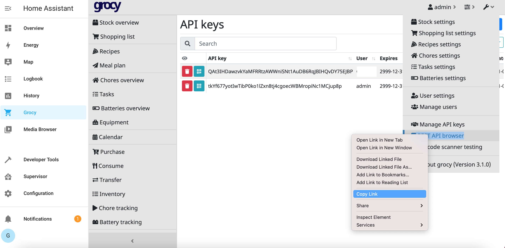
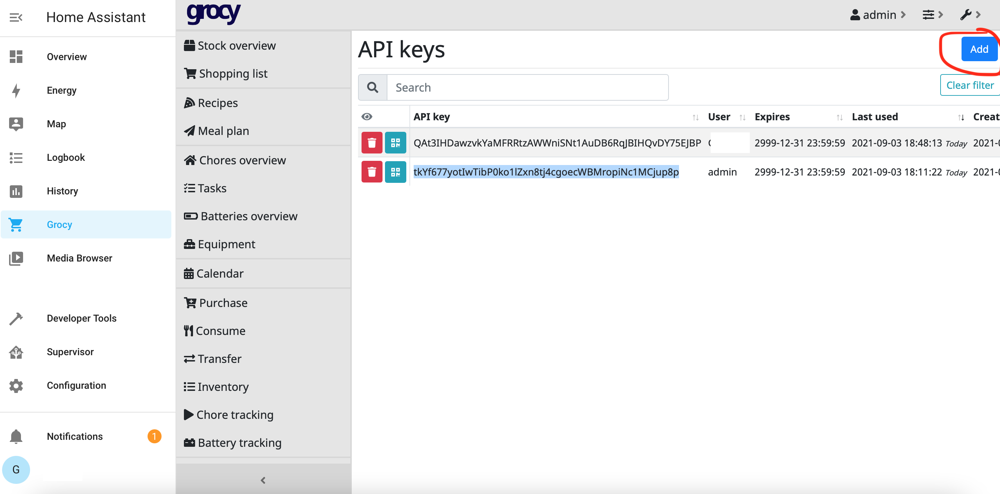
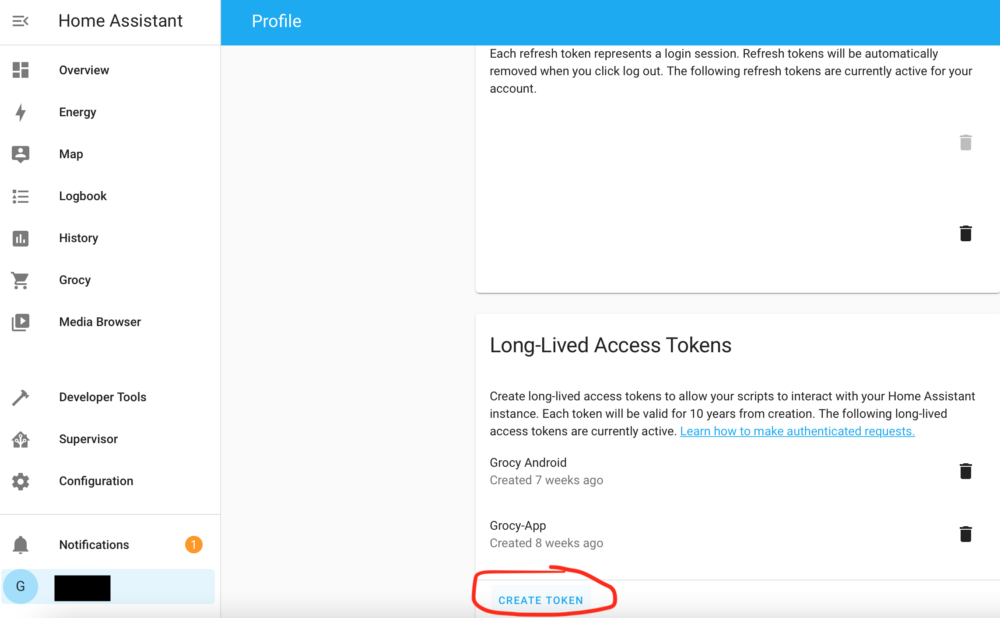
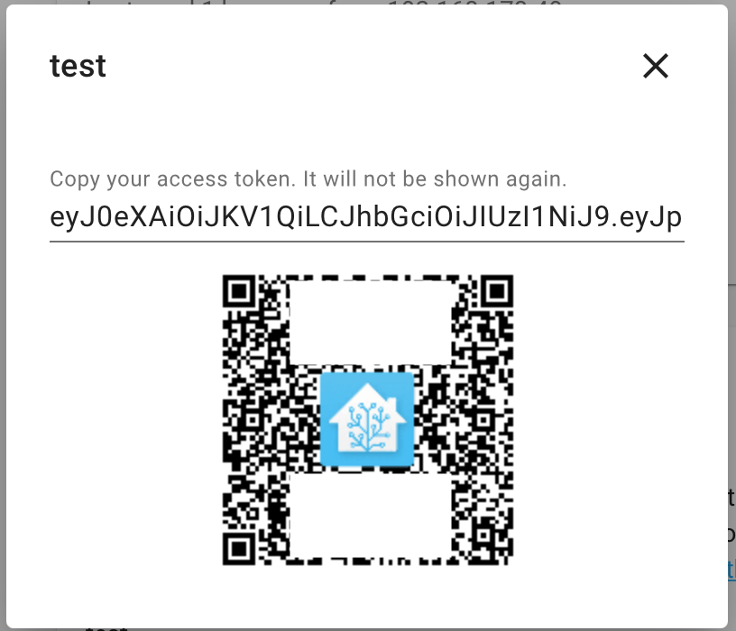

# Guide for using Home Assistant Ingress with Grocy Mobile

This guide is a small description on how to use Home Assistant Ingress with Grocy Mobile.

## Getting the Grocy Login data
### Quick Way (iOS)
If you are on iOS and can open Home Assistant Grocy on another device, there is a fast way. Just press the QR Code icon next to the API key in the _API keys_ view on the web interface. Then press the _QR Scan_ button in the app and scan the QR code.

### Manual Way
If you can't do this (or use the app on macOS), you need to do this manually.
#### Grocy Ingress URL
First you need to get the Grocy Ingress URL. This is the direct URL under which Grocy can be reached in Home Assistant.
You can get this by copying the link to the _Grocy API browser_.

#### Grocy API key
Next, you need to get the corresponding API key.
If you already have one, just copy it.
Otherwise, create a new on by pressing the _Add_ button.

## Generating the Home Assistant Access Token
To use Home Assistant Ingress, the app needs access to the Home Assistant API.
For this, an access-token needs to be generated and entered into the app.

### Generating the token
To generate the token, you need to open your profile page in Home Assistant.
Scroll down on this page to _Long-Lived Access Tokens_.
Press the create token and name it (e.g. Grocy Mobile).

### Entering the token
If you have created the token, you can copy it into the app.
To simplify this, you can press the QR code button and scan the token in the app.

## Finished
If you have Grocy URL, Grocy API key as well ass the Home Assistant Token, you are ready to go. Just press login within the app.